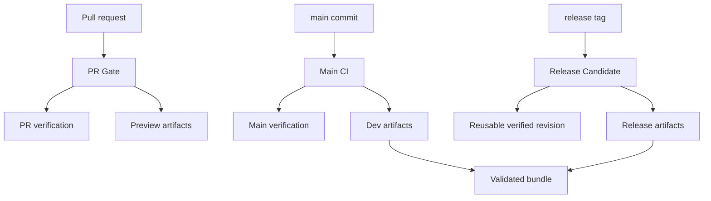

# Requirements

### Goal
Finish the TeamCity prototype as a clean, developer-oriented CI/CD design before attempting a cutover. The next priority is an understandable hierarchy of pipelines, native TeamCity composition, correct hosted-agent sizing, and observability; repeated multi-hour runs will stabilize that design before publishing, branch-protection, or GitHub workflow removal changes.

### In Scope
- Refactor the synchronized `Opaque` Kotlin DSL project at `https://jbr-fed.teamcity.com` into a small set of user-facing build chains with leaf work grouped below them.
- Retain the completed package-shard CPU test matrix, one pure-Python wheel build, and the three cloud-compatible `opaque-accounting` wheel configurations for Linux x86_64, Linux ARM64, and macOS ARM64. Keep the MPS matrix configuration disabled until TeamCity provides a larger compatible macOS hosted-agent type.
- Make PR, `main`, and release-tag behavior explicit: PR excludes `slow`, main/release verification includes it, and retain MPS/CUDA configurations as paused capacity-dependent lanes until compatible hosted agents are available.
- Make TeamCity alone own trigger placement, snapshot/artifact dependencies, immutable artifact identity, reporting, cleanup, and status publishing for migrated compute.
- Route long-running Python and Rust tests to explicitly selected large hosted agents; route docs, pure-Python builds, validation, and non-native build work to smaller agents where compatible. Treat native accounting build sizing as a measured exception.
- Establish an advisory daily Linux compatibility sweep with one current committed-lock `amd64` lane plus focused direct-dependency floor and ceiling coverage for PyTorch and Hugging Face integration.
- Keep GitHub Actions as the required fallback and retain GitHub-native PR-title and draft-Release automation throughout stabilization.

### Out of Scope Until Stabilization Exits
- Keep the TeamCity prototype on the dedicated `teamcity-prototype-stabilization` branch; `main` carries none of its configuration or workflow changes until stabilization approval.
- No required TeamCity check, GitHub compute-job deletion, or production package publication.
- No assumption that the existing JetBrains Space connection supplies `twine` credentials; the separate protected publisher credential may be prepared now, but its deployment configurations remain paused until the delivery chains are proven.
- No replacement of substantive artifact-contract Python checks in `.github/scripts/check_wheel_internal_pins.py` and `.github/scripts/check_accounting_artifact_policy.py` merely to eliminate Python.

### Acceptance Criteria
- The TeamCity UI presents a small, stable root set of named entry points: `PR Gate`, `Main CI`, and `Release Candidate`; CPU, Rust, docs, and paused deployment configurations are grouped in their appropriate subprojects, and disabled MPS/CUDA configurations are retained in `Verification` for later capacity validation.
- Exactly one entry chain triggers for each PR, `main` commit, or release tag. Leaf configurations have no independent VCS triggers, preventing duplicate work and overlapping publication paths.
- A PR and `main` pipeline fan out tests and distribution work in parallel, but deployment may consume only the validated artifact bundle and the matching successful verification for the same VCS revision.
- The test matrix remains readable as TeamCity-generated shard batches; the three accounting targets remain concrete configurations because their OS/architecture pairs cannot be represented safely by an `os × arch` matrix on hosted agents.
- Every completed run exposes JUnit test results where produced, artifact links, a consistent version/SHA manifest, agent image/size, queue time, and stage duration needed to diagnose a 10–20 minute job.
- Each concrete accounting wheel builder installs its fresh wheel in a clean target environment with local `opaque-base`, imports the PyO3 extension, and creates a minimal PLD before publishing the artifact.
- A daily compatibility sweep records a generated resolution lock and version manifest for its direct-dependency floor and ceiling lanes; its first failure creates an investigation rather than being allowed to remain an unattended weekly report.
- The new topology completes repeated representative PR, `main`, and tag rehearsals without duplicate chains, artifact ambiguity, agent-incompatibility queueing, or a regression from the GitHub parity baseline.

# Technical Design

### Current Implementation
- `teamcity.toml` links the repository to TeamCity project `Opaque` at `https://jbr-fed.teamcity.com`; versioned Kotlin settings are synchronized from `.teamcity/settings.kts`.
- `.teamcity/TestBuilds.kt` models the 11 package/repository shards as TeamCity matrix values for `Python CPU tests`, retains disabled `Python MPS tests` and `Python CUDA tests` configurations until compatible hosted capacity is available, and reports `pytest` JUnit XML. The matrix expansion accounts for many of the displayed configurations; these are generated shard batches, not independently maintained pipelines.
- `.teamcity/DistributionBuilds.kt` has one `PythonWheels` build, three concrete `AccountingVariant` builds with clean installed-wheel native smokes, `AccountingSdist`, and `ValidateDistributions`. The current `PreviewDistributions` tree correctly fans out to all five builders before validation.
- The current `OpaqueTestsPr`/`OpaqueTestsMain`, preview/dev/release distribution chains, and `PublicationBuilds.kt` have overlapping triggers and `ReuseBuilds.NO` snapshot dependencies. A `main` delivery can therefore repeat work already started by verification or artifact chains, and tag publication cannot safely rely on the `main`-only verification configuration.
- `.github/workflows/pr.yml` and `ci.yml` still provide the parity baseline. `.github/workflows/release.yml` retains only the GitHub-native tag-reachability guard; package artifacts are not copied to GitHub Releases.

### Key Decisions
- Use Kotlin DSL under `.teamcity/` as the sole description of TeamCity behavior. Centralize package, target, branch-kind, agent-class, artifact, and status-context declarations in typed Kotlin rather than duplicating them across `TestBuilds.kt` and `DistributionBuilds.kt` or calling the GitHub matrix-discovery script.
- Use TeamCity projects, templates, matrix builds, VCS/PR triggers, snapshot dependencies, artifact dependencies, output parameters, cleanup rules, agent requirements, JUnit reporting, and commit-status publishing before adding runner logic. Runner steps remain direct invocations of `uv`, `pytest`, `cargo`, `mkdocs`, `maturin`, and `twine` only where TeamCity has no equivalent.
- Keep one CPU matrix. Retain the MPS matrix as a disabled configuration until a larger compatible TeamCity macOS image is available. Keep `PythonWheels` as one platform-agnostic build. Keep the three accounting wheel configurations concrete and cloud-compatible, as selected, because standard hosted-agent OS/architecture requirements cannot encode only the valid correlated target pairs in one matrix.
- Trigger only top-level entry chains. Their dependencies run at the same VCS revision and reuse a successful matching dependency when safe; child configurations do not independently trigger or publish GitHub statuses.
- Use `PR Gate` and `Main CI` as the only GitHub commit-status contexts during observation. MPS and CUDA configurations remain paused and excluded from PR, main, and tag verification until compatible capacity is registered; when enabled, CUDA is an ordinary test dependency for every revision type.
- Select hosted agents by verified standard image/name and OS/architecture properties, not just a generic memory threshold. Linux CPU tests and Rust tests use a Linux Large image; MPS remains disabled pending a larger compatible macOS image; docs/pure wheels/validation use smaller compatible images; native accounting targets start with their smallest viable image and are promoted only if soak data demonstrates a need.
- Do not enable a deployment trigger during stabilization. Later publication must use protected TeamCity service credentials or a documented package-feed integration; a Space connection is not treated as implicit PyPI/Twine credentials.

### Target Project and Chain Topology

- `Opaque` becomes a curated root project containing only the PR, main, and tag composites. `Verification`, `Artifacts`, and `Delivery` subprojects contain templates and leaves, with paused deployment entry configurations co-located in `Delivery` to enforce release-manager-only permissions; generated matrix batches remain beneath their matrix parent in the UI.
- `PR Gate` has snapshot dependencies on `PR verification` and `Preview artifacts`, which run in parallel. `PR verification` contains CPU tests, Rust tests, and strict docs; paused MPS/CUDA configurations are excluded until compatible capacity is available. `Preview artifacts` contains version preparation, five builders, and validation.
- `Main CI` invokes `main verification` and `dev artifacts` in parallel. Slow marker coverage is selected by a typed branch policy, not inline branch checks scattered in shell steps. A later paused `Publish dev` deployment receives only the exact validation artifact and matching successful verification.
- `Release Candidate` builds a release-versioned artifact bundle for the tag and either reuses a successful verification of the identical tagged revision or starts a tag-scoped full verification build when none exists. It never snapshots `OpaqueTestsMain` on a tag branch as though that were sufficient proof.
- A `PrepareVersion` leaf computes the immutable version once per chain, exposes it as an output parameter, and emits a manifest. It is deliberately never reused across chains because its output is branch-derived; the shared dependency node still executes only once within a chain. Build templates consume that parameter and create the same manifest fields (`VCS SHA`, version, source build ID, target) in their artifacts. Short POSIX command steps are acceptable for VCS-derived version data and manifest patching; package lists, branching rules, target selection, and dependency orchestration belong in Kotlin.
- Each concrete accounting builder validates its own fresh target artifact through a clean installed-wheel native smoke. `ValidateDistributions` then downloads artifacts only through snapshot-bound artifact dependencies into target-qualified directories, validates the 13 wheels plus sdist with the existing substantive contract scripts, and publishes the single validated bundle used by later deployment.

### Kotlin DSL Structure
- Modify `.teamcity/settings.kts` to register the new subprojects, retain only PR/main/tag entry composites at the root, and colocate paused deployment entries with credential-bearing delivery leaves.
- Add `.teamcity/CiModel.kt` for the package inventory, test devices/markers, accounting targets, branch modes, named agent classes, artifact counts, and status context constants.
- Add `.teamcity/BuildTemplates.kt` for shared `uv` bootstrap, checkout/caching policy, test timeout/reporting, distribution version input, and cleanup rules. Remove the duplicated `ensureUv()` functions from `TestBuilds.kt` and `DistributionBuilds.kt`.
- Refactor `.teamcity/TestBuilds.kt`, `.teamcity/DistributionBuilds.kt`, and `.teamcity/PublicationBuilds.kt` to consume that model. Add `.teamcity/PipelineChains.kt` for the PR/main/tag composites and their sole triggers/status publishers.
- Replace implicit `teamcity.build.branch` shell decisions and unconditional `ReuseBuilds.NO` with typed DSL branch policies and revision-safe dependency-reuse rules. Main/tag test leaves use static slow-inclusive defaults so exact tag revisions can reuse main verification; PR alone overrides markers to exclude `slow`. `PrepareVersion` is the branch-derived identity exception and always runs fresh. Preserve build type IDs where feasible so existing history and links remain useful.

### Hosted-Agent and Developer Experience Design
- Encode the selected hosted image/architecture requirement once per `AgentClass`, after validating its exact TeamCity capability name against a started cloud agent. This prevents a queued job matching an unsupported architecture or an undersized agent.
- Give every matrix and build a stable human-readable label, target-qualified artifact path, deterministic timeout, and JUnit/coverage artifact location. Retain `perfmon` for test workloads and make queue, bootstrap, dependency-sync, execution, and artifact stages separately visible in build logs.
- Use TeamCity caching only through supported hosted-agent cache features and scoped cache keys for `uv` and Cargo inputs. Prune `uv` caches with `uv cache prune --ci` before TeamCity publishes them so pre-built PyTorch downloads do not exceed artifact-cache limits; measure clean and warm behavior during stabilization rather than assuming an ephemeral cloud agent retains a filesystem cache.

### Compatibility Verification Strategy
- The committed `uv.lock` remains the reproducible PR and release baseline. A daily `Compatibility sweep` in a future `Compatibility` subproject runs one complete CPU suite against that lock on the normal Linux `amd64` configuration.
- Boundary compatibility uses `uv lock --upgrade --resolution lowest-direct` with Python `3.11` on Linux `amd64`, and `uv lock --upgrade --resolution highest` with Python `3.12` on Linux `aarch64`. These lanes run the focused `opaque-patches` and `opaque-transformers` integration suites, publish their generated lock and version manifest, and do not overwrite the repository lock.
- The dependency floor validates published lower bounds without resolving unusably old transitive packages. The ceiling follows the workspace upper bounds: PyTorch `<2.13`, Transformers `<5.12` (within its published `<6` support range), PEFT `<0.19`, and TRL `<1.7`.
- Normal PRs retain only the deterministic committed-lock gate. Dependency, patch, or Transformers changes run both boundary lanes before merge; the three-lane compatibility sweep runs daily after normal main verification, with a 40-minute timeout per leaf and an investigation on its first failure.

### Safety and Deferred Delivery
- Fork PRs never receive credential-bearing parameters. MPS/CUDA configurations remain paused until capacity is available, after which CUDA uses the same lane for every revision type. Deployment configurations remain paused and have no VCS trigger until artifact-flow rehearsals pass.
- GitHub Releases carry release metadata only; validated package artifacts remain in TeamCity and the package repository rather than being copied to GitHub.
- GitHub Actions remains the required source of truth throughout the soak; direct TeamCity statuses are advisory. Required checks, package publishing, and removal of GitHub compute happen only after the stabilization exit criteria are met.

# Testing

### Configuration Validation
- Run the TeamCity Kotlin DSL Maven generation and server-side settings validation after each structural change. Inspect the server build graph to confirm the root hierarchy, generated matrix batches, branch filters, single-trigger rule, and artifact dependencies match the target topology.
- Exercise a representative internal PR, fork PR, `main` revision, and non-production tag using the root entry chains. Confirm PR cancellation cancels obsolete work, while `main`/tag chains are not canceled.
- Verify each active target selects the intended hosted image: Linux Large for CPU/Rust tests and the configured smaller image for docs/build/validation where applicable. Keep MPS/CUDA disabled until compatible macOS/GPU images are available, then diagnose compatibility before re-enabling them.

### Stabilization Evidence and Exit Criteria
- Run the refactored entry chains repeatedly for as many hours and revisions as needed to cover cold starts, warm cache behavior, concurrent PR pressure, canceled PR updates, all three native accounting targets, and an exact tag rehearsal.
- For each run, record queue time, image provisioning, setup, test matrix, wheel build, validation, retry/failure rate, test count/skips, artifact manifest, and GitHub status behavior. Compare these with the still-running GitHub baseline.
- For the daily compatibility sweep, retain the resolved `uv.lock`, Python/OS/architecture, direct dependency versions, and focused JUnit results. Classify failures as platform/interpreter, floor dependency, ceiling dependency, or native-wheel runtime before changing package bounds.
- Treat a duplicate trigger, wrong revision/artifact dependency, no-compatible-agent queue, missing report/artifact, unsafe fork behavior, or package-version mismatch as a blocker. Fix the topology or its typed model first, then continue the soak.
- Exit stabilization only after repeated successful complete chains have predictable capacity behavior and all parity evidence is retained. At that point, make a separate decision to unpause promotion and change branch protection.

# Delivery Steps

### ✓ Step 1: Create the curated TeamCity project model and reusable templates
The `Opaque` TeamCity project exposes a small, intelligible hierarchy backed by one typed Kotlin source of truth.

- Add `.teamcity/CiModel.kt` with the package inventory, device/marker policy, three valid accounting targets, branch kinds, hosted-agent classes, artifact-set expectations, and status names.
- Add `.teamcity/BuildTemplates.kt` to own bootstrap, checkout, supported cache policy, test reporting, timeouts, cleanup, and version-input behavior; remove duplicated helpers from `TestBuilds.kt` and `DistributionBuilds.kt`.
- Update `.teamcity/settings.kts` to introduce `Verification`, `Artifacts`, and `Delivery` subprojects while keeping only curated PR/main/tag composites at the root and placing paused deployments in `Delivery`.
- Refactor the existing test, distribution, and publication Kotlin files to consume the shared model, preserving matrix tests, the single pure-wheel build, and the selected three concrete accounting build targets.
- Generate and validate the Kotlin DSL, then inspect the project tree to verify that generated matrix children are nested under their matrix configuration rather than presented as manually maintained root pipelines.

### ✓ Step 2: Recompose PR, main, and tag processing into single-entry build chains
Each revision type starts one non-duplicating TeamCity chain with exact revision and artifact handoff semantics.

- Add `.teamcity/PipelineChains.kt` and move VCS/PR triggers plus GitHub status publishing from leaf/overlapping chains to `PR Gate`, `Main CI`, and `Release Candidate` only.
- Make PR verification and preview artifacts run in parallel; include CPU/Rust/docs in normal verification, retain MPS/CUDA as paused configurations until compatible capacity is available, and exclude `slow` from PR markers.
- Make `Main CI` run slow-inclusive verification alongside dev artifact construction, with publication disconnected and paused during the soak.
- Add `PrepareVersion` output parameters and immutable manifest artifacts so all dependent builders use one fresh per-chain version and validation consumes only target-qualified artifacts from the same snapshot chain.
- Use revision-safe reuse for branch-independent test leaves, while keeping version preparation fresh. Add a tag-aware verification path that reuses exact successful main verification where suitable and otherwise starts tag-scoped verification; it never substitutes a `main`-branch result for an unverified tag revision.
- Start representative PR, `main`, and tag-rehearsal chains to verify exactly one trigger fires per entry point and failed dependencies block downstream validation/deployment.

### ✓ Step 3: Apply explicit hosted-agent policy and TeamCity-native run diagnostics
Tests run on deliberately large machines while ordinary build work is economical and every long run is diagnosable in TeamCity.

- Encode verified cloud image-name, OS, and architecture requirements in the shared agent classes: Linux Large for CPU/Rust tests and smaller compatible images for docs, pure wheels, validation, and other non-native work. Keep MPS/CUDA disabled until TeamCity provides compatible macOS/GPU images.
- Start native accounting on the smallest compatible Linux/macOS images, collect memory and duration evidence, and move only the constrained targets to a larger class when measurement justifies it.
- Publish JUnit results, coverage artifacts, target-qualified wheel artifacts, and version/SHA manifests from the appropriate leaf templates; retain `perfmon` on test workloads. Install and smoke each fresh accounting wheel on its target builder before publishing it as an artifact.
- Configure supported `uv` and Cargo cache handling with scoped keys, and report clean versus warm setup cost rather than relying on persistent hosted-agent directories.
- Validate agent compatibility and one full run per active platform target before beginning the extended stabilization workload; reintroduce MPS/CUDA validation when compatible macOS/GPU images become available.

### * Step 4: Stabilize the refactored chains under sustained realistic load
The refactored TeamCity design has evidence of reliable, repeatable operation before it becomes a delivery or merge gate.

- Run PR, fork-PR, `main`, and non-production tag entry chains repeatedly for as many hours and revisions as required to exercise cold provisioning, warm caches, matrix parallelism, cancellation, and concurrent queues.
- After the active entry chains are stable, run the advisory daily Linux compatibility sweep and resolve or pin its first failure before allowing a subsequent sweep to replace its evidence.
- Compare test counts/skips, wheel names/metadata, manifest identity, validation results, durations, queueing, provisioning, and retry/failure rates against the active GitHub Actions baseline.
- Correct any topology, cache, hosted-image, reporting, artifact-dependency, or revision-reuse issue found during the soak and rerun the affected scenario until the evidence is stable.
- Keep TeamCity statuses advisory, deployment paused, and GitHub compute required throughout this stage; record the GPU and other capacity assumptions needed for reliable operation.

###   Step 5: Activate protected delivery and cut over only after stabilization approval
Validated TeamCity artifacts can be promoted safely and GitHub can rely on TeamCity without duplicate compute.

- Verify the protected TeamCity package authentication path with a non-production artifact promotion rehearsal, then unpause main/tag deployment configurations only after that rehearsal succeeds.
- Retain GitHub Release metadata automation without package-asset attachment; TeamCity and the package repository remain the only distribution artifact locations.
- Promote the stable `PR Gate` status to a required GitHub check, preserve GitHub-native title/release automation, and remove duplicate GitHub test/build/validation callers only after TeamCity parity is demonstrated.
- Document the final agent image requirements, cache behavior, deployment credential ownership, rollback path, and the measured savings/capacity evidence alongside the TeamCity project configuration.