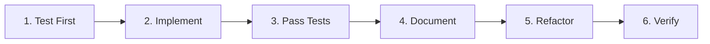

# TDD Workflow

Opaque follows a Test-Driven Development (TDD) workflow to ensure correctness and maintainability.

---

## Workflow Overview



---

## Step 1: Write Failing Test

**Goal**: Define the API through a test before writing any implementation code.

### Test Location

```
tests/
├── clipping/         # Clipping functionality tests
├── noise/            # Noise injection tests
├── accounting/       # Privacy accounting tests
├── optimizers/       # Optimizer tests
├── sampling/         # Sampling tests
└── integration/      # End-to-end integration tests
```

### Template

```python
import pytest
import torch
from opaque.clipping import clipped_grad

def test_clipped_grad_basic():
  """Test that clipped_grad clips gradients to max norm."""

  # Setup
  def loss_fn(params, batch):
    x, y = batch
    pred = params['weight'] @ x
    return torch.mean((pred - y) ** 2)

  params = {'weight': torch.randn(10, 5, requires_grad=True)}
  batch = (torch.randn(32, 5), torch.randn(32, 10))

  # Create clipped gradient function
    clipped_grad_fn = clipped_grad(
        loss_fn,
      argnums=0,
      batch_argnums=1,
        l2_clip_norm=1.0,
    )

  # Compute gradients
  grads = clipped_grad_fn(params, batch)

  # Verify: Each per-example gradient should have L2 norm <= 1.0
  assert grads['weight'].shape == params['weight'].shape
```

### Best Practices

- **Test one thing**: Each test should verify a single behavior
- **Clear names**: Use descriptive test names that explain what's being tested
- **Arrange-Act-Assert**: Structure tests with setup, execution, and verification
- **Edge cases**: Include tests for empty inputs, zeros, NaN, inf, etc.

---

## Step 2: Implement (Minimal Code)

**Goal**: Write the minimum code to make the test pass.

### Implementation Guidelines

1. **Start simple**: Don't over-engineer the first implementation
2. **Make it work**: Focus on correctness, not optimization
3. **No extra features**: Only implement what the test requires
4. **Incremental**: Add one feature at a time

### Example

```python
# src/opaque/clipping/clipped_grad.py
import torch
from torch.func import grad, vmap


def clipped_grad(loss_fn, argnums=0, batch_argnums=1, l2_clip_norm=1.0):
  """Compute per-example clipped gradients."""

  # Step 1: Compute per-example gradients using vmap
  grad_fn = grad(loss_fn, argnums=argnums)

  # Step 2: Vectorize over batch dimension
  batched_grad_fn = vmap(grad_fn, in_dims=(None, batch_argnums))

  def clipped_fn(params, batch):
    # Compute per-example gradients
    per_example_grads = batched_grad_fn(params, batch)

    # Clip each gradient (implementation details omitted for brevity)
    # ... clipping logic ...

    return clipped_grads

  return clipped_fn
```

---

## Step 3: Pass Tests

**Goal**: Verify that the implementation passes all tests.

### Run Tests

```bash
# Run specific test
uv run pytest tests/clipping/test_clipped_grad.py::test_clipped_grad_basic -v

# Run all tests in module
uv run pytest tests/clipping/ -v

# Run with coverage
uv run pytest tests/clipping/ --cov=opaque.clipping --cov-report=term
```

### Fix Failures

- Read error messages carefully
- Add debug prints if needed
- Use pytest's `-v` and `-s` flags for verbose output
- Use `breakpoint()` for interactive debugging

---

## Step 4: Document

**Goal**: Add comprehensive documentation with examples.

### Docstring Template

Use Google-style docstrings:

```python
def clipped_grad(
  loss_fn: Callable,
  argnums: int = 0,
  batch_argnums: int = 1,
  l2_clip_norm: float = 1.0,
) -> Callable:
  """Compute per-example clipped gradients for a loss function.

  This function creates a new function that computes gradients of `loss_fn`
  with respect to the parameter at `argnums`, clips each per-example gradient
  to have L2 norm at most `l2_clip_norm`, and returns the average clipped gradient.

  Args:
      loss_fn: Loss function with signature (params, batch) -> scalar
      argnums: Index of the parameter argument to differentiate
      batch_argnums: Index of the batch argument to vectorize over
      l2_clip_norm: Maximum L2 norm for per-example gradients

  Returns:
      Callable with signature (params, batch) -> clipped_gradients

  Example:
      >>> def loss_fn(params, batch):
      ...     x, y = batch
      ...     pred = params @ x
      ...     return torch.mean((pred - y) ** 2)
      >>>
      >>> params = torch.randn(10, 5, requires_grad=True)
      >>> batch = (torch.randn(32, 5), torch.randn(32, 10))
      >>>
      >>> clipped_grad_fn = clipped_grad(loss_fn, l2_clip_norm=1.0)
      >>> grads = clipped_grad_fn(params, batch)

  Note:
      The returned gradient is the **mean** of the clipped per-example gradients,
      not the sum. This matches standard SGD behavior.
  """
```

### Documentation Requirements

- ✅ Clear description of what the function does
- ✅ All parameters documented with types
- ✅ Return value documented
- ✅ At least one usage example
- ✅ Important notes and warnings

---

## Step 5: Refactor

**Goal**: Improve code quality without changing behavior.

### Refactoring Checklist

- [ ] Remove duplicate code
- [ ] Extract helper functions for complex logic
- [ ] Improve variable names for clarity
- [ ] Add type hints
- [ ] Simplify conditional logic
- [ ] Optimize performance (if needed)

### Example Refactoring

```python
# Before: Inline clipping logic
def clipped_grad(loss_fn, l2_clip_norm=1.0):
  def clipped_fn(params, batch):
    grads = compute_grads(params, batch)
    # Inline clipping
    norms = torch.sqrt(sum(torch.sum(g ** 2) for g in grads.values()))
    scale = min(1.0, l2_clip_norm / (norms + 1e-8))
    clipped = {k: v * scale for k, v in grads.items()}
    return clipped

  return clipped_fn


# After: Extract to helper function
def clipped_grad(loss_fn, l2_clip_norm=1.0):
  def clipped_fn(params, batch):
    grads = compute_grads(params, batch)
    return clip_pytree(grads, l2_clip_norm)  # Extracted helper

  return clipped_fn
```

---

## Step 6: Verify

**Goal**: Run full test suite to ensure no regressions.

### Verification Commands

```bash
# Run all tests (excluding slow)
uv run pytest

# Run all tests including slow tests
uv run pytest -m ""

# Run with coverage report
uv run pytest --cov=opaque --cov-report=html

# View coverage
open htmlcov/index.html
```

### Coverage Requirements

- ✅ All new functions must have >80% coverage
- ✅ All branches should be tested
- ✅ Edge cases must be covered

---

## Complete Example Workflow

Let's walk through implementing `add_gaussian_noise()`:

### 1. Write Failing Test

```python
# tests/noise/test_gaussian.py
import torch
from opaque.noise import add_gaussian_noise


def test_add_gaussian_noise_basic():
  """Test that Gaussian noise is added to gradients."""
  grads = {'weight': torch.randn(10, 5)}
  stddev = 0.1

  noisy_grads = add_gaussian_noise(grads, stddev=stddev)

  # Verify shape is preserved
  assert noisy_grads['weight'].shape == grads['weight'].shape
```

Run test (should fail):
```bash
uv run pytest tests/noise/test_gaussian.py::test_add_gaussian_noise_basic -v
```

### 2. Implement

```python
# src/opaque/noise/gaussian.py
import torch


def add_gaussian_noise(pytree, stddev):
  """Add Gaussian noise to PyTree of tensors."""

  def add_noise(tensor):
    noise = torch.randn_like(tensor) * stddev
    return tensor + noise

  return torch.utils._pytree.tree_map(add_noise, pytree)
```

### 3. Pass Tests

```bash
uv run pytest tests/noise/test_gaussian.py -v
# ✅ All tests pass
```

### 4. Document

```python
def add_gaussian_noise(pytree, stddev):
  """Add independent Gaussian noise to each element of a PyTree.

  Args:
      pytree: PyTree of tensors
      stddev: Standard deviation of Gaussian noise

  Returns:
      PyTree with same structure as input, with noise added

  Example:
      >>> grads = {'weight': torch.tensor([1.0, 2.0, 3.0])}
      >>> noisy_grads = add_gaussian_noise(grads, stddev=0.1)
  """
```

### 5. Refactor

(Minimal refactoring needed for this simple function)

### 6. Verify

```bash
uv run pytest --cov=opaque.noise --cov-report=term
# ✅ 100% coverage
```

---

## Common Patterns

### Testing PyTree Functions

```python
def test_pytree_function():
  """Test function that operates on PyTrees."""
  # Setup: Create nested PyTree
  pytree = {
    'layer1': {'weight': torch.randn(10, 5), 'bias': torch.randn(10)},
    'layer2': {'weight': torch.randn(5, 3)},
  }

  # Act: Apply function
  result = my_pytree_function(pytree)

  # Assert: Check structure and values
  assert result.keys() == pytree.keys()
  assert result['layer1'].keys() == pytree['layer1'].keys()
```

### Testing Edge Cases

```python
@pytest.mark.parametrize("clip_norm,expected", [
  (0.0, 0.0),  # Zero clip norm
  (float('inf'), 1.0),  # Infinite clip norm
  (1.0, 1.0),  # Normal case
])
def test_clipping_edge_cases(clip_norm, expected):
  """Test clipping with edge case norms."""
  grads = {'weight': torch.ones(5)}
  clipped = clip_pytree(grads, clip_norm)
  # ... assertions ...
```

### Testing Randomness

```python
def test_noise_is_different():
  """Test that noise is random (not deterministic)."""
  grads = {'weight': torch.zeros(10)}

  noisy1 = add_gaussian_noise(grads, stddev=0.1)
  noisy2 = add_gaussian_noise(grads, stddev=0.1)

  # Should be different due to randomness
  assert not torch.allclose(noisy1['weight'], noisy2['weight'])
```

---

## Testing Best Practices

### Property-Based Testing

Use Hypothesis for property-based tests:

```python
from hypothesis import given, strategies as st


@given(
  clip_norm=st.floats(min_value=0.1, max_value=10.0),
  grad_norm=st.floats(min_value=0.0, max_value=20.0),
)
def test_clipping_always_within_norm(clip_norm, grad_norm):
  """Property: Clipped gradients always have norm <= clip_norm."""
  # ... test implementation ...
```

### Slow Tests

Mark slow tests to run them optionally:

```python
@pytest.mark.slow
def test_large_batch_memory():
  """Test with very large batch size (slow)."""
  batch_size = 10000
  # ... test implementation ...
```

Run slow tests:
```bash
uv run pytest -m ""  # Include slow tests
uv run pytest        # Exclude slow tests (default)
```

### Integration Tests

```python
@pytest.mark.integration
def test_full_dp_training_loop():
  """Integration test: Full DP-SGD training."""
  # ... full training loop ...
```

---

## Summary

The TDD workflow ensures:

✅ **Correctness**: Tests define expected behavior
✅ **Maintainability**: Well-documented code with examples
✅ **Confidence**: High test coverage catches regressions
✅ **Design**: Test-first leads to better APIs

**Remember**: Test first, implement second, refactor third!
