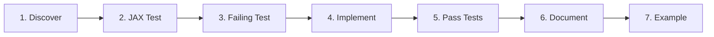

# TDD Workflow

Opaque follows a Test-Driven Development (TDD) workflow inspired by the principles of test-first development, adapted for porting from JAX-Privacy.

---

## Workflow Overview



---

## Step 1: Discover in JAX-Privacy

**Goal**: Understand the reference implementation before writing any code.

### What to Study

Explore the JAX-Privacy codebase at `../jax_privacy`:

```bash
# For clipping
../jax_privacy/src/experimental/clipping.py

# For noise
../jax_privacy/src/dp_sgd/noise_injection.py
```

### Questions to Answer

- **What is the function signature?**
- **What edge cases does it handle?**
- **How does it compose with other functions?**
- **What tests exist in JAX-Privacy?**
- **What are the performance characteristics?**

### Example

```python
# Study this in JAX-Privacy
from jax_privacy.experimental.clipping import clipped_grad

# Understand:
# - Parameters: l2_clip_norm, batch_argnums, microbatch_size, etc.
# - Return type: Callable that computes clipped gradients
# - Edge cases: Empty grads, NaN handling, zero norms
```

---

## Step 2: Create JAX Reference Test (Optional)

**Goal**: Validate our understanding of JAX-Privacy behavior.

**Location**: `tests/jax_validation/test_jax_<module>.py`

### Template

```python
import pytest

pytest.importorskip("jax")
pytest.importorskip("jax_privacy")

import jax.numpy as jnp
from jax_privacy.experimental.clipping import clipped_grad

@pytest.mark.jax_validation
def test_jax_clipped_grad_reference():
    """Reference test: Understand how JAX-Privacy's clipped_grad works."""

    def loss_fn(param, data):
        return 0.5 * jnp.mean((data - param) ** 2)

    clipped_grad_fn = clipped_grad(
        loss_fn,
        l2_clip_norm=1.0,
    )

    param = jnp.array(3.0)
    data = jnp.array([0.0, 7.0, -2.0])

    result = clipped_grad_fn(param, data)

    # Document observed behavior
    assert result.shape == ()  # Scalar gradient
    assert jnp.abs(result) <= 3.0  # Sum of 3 unit-norm gradients

    # Document actual value for future comparison
    print(f"JAX result: {result}")
```

### Run

```bash
uv run --group jax-validation pytest tests/jax_validation/ -m jax_validation -v
```

---

## Step 3: Create Failing Opaque Test

**Goal**: Define the API and expected behavior for PyTorch implementation.

**Location**: `tests/core/test_<module>.py`

### Template

```python
import torch
from opaque.clipping import clipped_grad


def test_clipped_grad_basic():
    """Test Opaque's clipped_grad against expected behavior."""

    def loss_fn(param, data):
        return 0.5 * ((data - param) ** 2).mean()

    clipped_grad_fn = clipped_grad(
        loss_fn,
        l2_clip_norm=1.0,
    )

    param = torch.tensor(3.0, requires_grad=True)
    data = torch.tensor([0.0, 7.0, -2.0])

    result = clipped_grad_fn(param, data)

    # Expected: sum of clipped per-example gradients
    assert result.shape == ()
    assert abs(result) <= 3.0  # Sum of 3 unit-norm gradients
```

### Run (Should Fail)

```bash
uv run pytest tests/core/test_clipped_fun.py::test_clipped_grad_basic -v
# Expected: ImportError or NotImplementedError
```

---

## Step 4: Implement Functionality

**Goal**: Make the tests pass with the simplest correct implementation.

**Location**: `src/opaque/core/<module>.py`

### Guidelines

1. **Start simple**: Make tests pass, don't optimize prematurely
2. **Handle edge cases explicitly**: Document with comments
3. **Add type hints**: Use `torch.Tensor`, not `torch.tensor`
4. **Follow code style**: Ruff will check

### Example Skeleton

```python
"""Per-example gradient clipping for differential privacy."""

import torch
from torch.utils._pytree import tree_leaves, tree_map

def clipped_grad(
    fun,
    argnums: int | tuple[int, ...] = 0,
    *,
    l2_clip_norm: float,
    batch_argnums: int | tuple[int, ...] = 1,
    rescale_to_unit_norm: bool = False,
    normalize_by: float = 1.0,
    keep_batch_dim: bool = True,
    microbatch_size: int | None = None,
    return_grad_norms: bool = False,
):
    """Return function computing sum of clipped per-example gradients.

    Args:
        fun: Scalar loss function (params, data) -> loss
        argnums: Which args to differentiate w.r.t.
        l2_clip_norm: Maximum gradient norm per example
        batch_argnums: Which args have batch dimension
        rescale_to_unit_norm: If True, sensitivity = 1.0
        normalize_by: Divide result by this value
        keep_batch_dim: Pass data with batch dim to loss
        microbatch_size: Process in chunks (None = full batch)
        return_grad_norms: Also return per-example norms

    Returns:
        Callable that computes clipped gradients

    Example:
        >>> def loss_fn(param, data):
        ...     return 0.5 * ((data - param) ** 2).mean()
        >>> clipped_grad_fn = clipped_grad(loss_fn, l2_clip_norm=1.0)
        >>> grad = clipped_grad_fn(torch.tensor(3.0), torch.tensor([0.0, 7.0]))
    """
    # Implementation here
    pass
```

---

## Step 5: Verify Tests Pass

**Goal**: Ensure all tests pass and code meets quality standards.

### Run Tests

```bash
# Run the specific test
uv run pytest tests/core/test_clipped_fun.py::test_clipped_grad_basic -v

# Run all tests for the module
uv run pytest tests/core/test_clipped_fun.py -v

# Run all tests
uv run pytest

# With coverage
uv run pytest --cov=opaque --cov-report=html
```

### Code Quality

```bash
# Format code
uv run ruff format src/ tests/

# Check linting
uv run ruff check src/ tests/

# Fix auto-fixable issues
uv run ruff check --fix src/ tests/
```

---

## Step 6: Add Documentation

**Goal**: Ensure code is self-documenting and examples work.

### Docstring Requirements

- **Google-style format**
- **One-line summary**
- **All parameters with types**
- **Return value with type**
- **At least one example**
- **References (if applicable)**

### Example

```python
def clip_pytree(
    pytree: dict[str, torch.Tensor],
    clip_norm: float,
    rescale_to_unit_norm: bool = False,
    nan_safe: bool = False,
) -> tuple[dict[str, torch.Tensor], torch.Tensor]:
    """Clip PyTree of tensors to maximum L2 norm.

    Computes the global L2 norm across all tensors in the PyTree and scales
    them proportionally to satisfy the norm constraint.

    Args:
        pytree: Dictionary of tensors (e.g., model gradients)
        clip_norm: Maximum L2 norm allowed
        rescale_to_unit_norm: If True, scale to unit norm
        nan_safe: If True, replace NaNs/Infs with zeros

    Returns:
        Tuple of (clipped_pytree, original_norm)

    Raises:
        ValueError: If clip_norm is negative or NaN

    Example:
        >>> grads = {'weight': torch.randn(10, 5), 'bias': torch.randn(5)}
        >>> clipped, norm = clip_pytree(grads, clip_norm=1.0)
        >>> compute_norm(clipped) <= 1.0 + 1e-6
        True

    References:
        Abadi et al. 2016, "Deep Learning with Differential Privacy"
        https://arxiv.org/abs/1607.00133
    """
```

---

## Step 7: Create Example (If Warranted)

**Goal**: Demonstrate usage for users.

### When to Create Examples

- New high-level API (e.g., `clipped_grad`, `make_private`)
- Complex feature needing demonstration
- Integration with external libraries

### Location

`examples/<number>_<descriptive_name>.py` or `.ipynb`

### Example Structure

```python
"""Example: Basic gradient clipping with Opaque.

Demonstrates:
- Per-example gradient computation
- Gradient clipping to maximum norm
- Comparison with non-clipped gradients
"""

import torch
from opaque.clipping import clipped_grad


def main():
    # Setup
    print("Setting up simple linear regression...")

    # Loss function
    def loss_fn(param, data):
        return 0.5 * ((data - param) ** 2).mean()

    # Create clipped gradient function
    clipped_grad_fn = clipped_grad(loss_fn, l2_clip_norm=1.0)

    # Demo
    param = torch.tensor(3.0, requires_grad=True)
    data = torch.tensor([0.0, 7.0, -2.0])

    clipped = clipped_grad_fn(param, data)
    print(f"Clipped gradient: {clipped}")


if __name__ == "__main__":
    main()
```

---

## JAX Validation Tests

For critical components, create cross-framework validation:

### Template

```python
import pytest

pytest.importorskip("jax")
pytest.importorskip("jax_privacy")

import jax.numpy as jnp
import torch
from jax_privacy.experimental.clipping import clipped_grad as jax_clipped_grad
from opaque.clipping import clipped_grad as torch_clipped_grad


@pytest.mark.jax_validation
def test_clipped_grad_matches_jax():
    """Verify Opaque matches JAX-Privacy output."""

    # JAX version
    def jax_loss(w, x):
        return 0.5 * jnp.mean((x - w) ** 2)

    jax_fn = jax_clipped_grad(jax_loss, l2_clip_norm=1.0)
    jax_result = jax_fn(jnp.array(3.0), jnp.array([0.0, 7.0, -2.0]))

    # PyTorch version
    def torch_loss(w, x):
        return 0.5 * ((x - w) ** 2).mean()

    torch_fn = torch_clipped_grad(torch_loss, l2_clip_norm=1.0)
    torch_result = torch_fn(torch.tensor(3.0), torch.tensor([0.0, 7.0, -2.0]))

    # Compare (allow moderate tolerance)
    assert torch.isclose(
        torch_result,
        torch.tensor(float(jax_result)),
        atol=1e-5,
        rtol=1e-5,
    )
```

---

## Best Practices

### DO

✅ Write tests before implementation
✅ Study JAX-Privacy behavior first
✅ Document edge cases in code
✅ Add type hints to public APIs
✅ Include docstring examples
✅ Run linter before committing

### DON'T

❌ Skip the discovery phase
❌ Implement without tests
❌ Ignore edge cases
❌ Commit failing tests
❌ Skip documentation
❌ Optimize prematurely

---

## Common Pitfalls

### 1. Skipping JAX Study

**Problem**: Implementing based on assumptions, not reality

**Solution**: Always study the reference implementation first

### 2. Not Testing Edge Cases

**Problem**: Code breaks in production on unexpected inputs

**Solution**: Write tests for:
- Empty inputs
- Zero/NaN/Inf values
- Extreme sizes (very large/small)
- Type variations

### 3. Incomplete Documentation

**Problem**: Users don't know how to use the API

**Solution**: Every public function needs:
- Docstring
- Example
- Type hints

---

## Quick Reference

```bash
# 1. Study JAX-Privacy
cd ../jax_privacy && rg "clipped_grad"

# 2. Write JAX reference test (optional)
uv run --group jax-validation pytest -m jax_validation -v

# 3. Write failing Opaque test
uv run pytest tests/core/test_clipped_fun.py -v

# 4. Implement
# (edit src/opaque/core/clipping.py)

# 5. Verify tests pass
uv run pytest tests/core/test_clipped_fun.py -v
uv run ruff format src/ tests/
uv run ruff check src/ tests/

# 6. Document
# (add docstrings and examples)

# 7. Create example (if needed)
# (add examples/XX_name.py)
```

---

## See Also

- [Contributing Guide](contributing.md)
- [Design Decisions](design-decisions.md)
- [Stage 1 Implementation Plan](stage1-plan.md)
